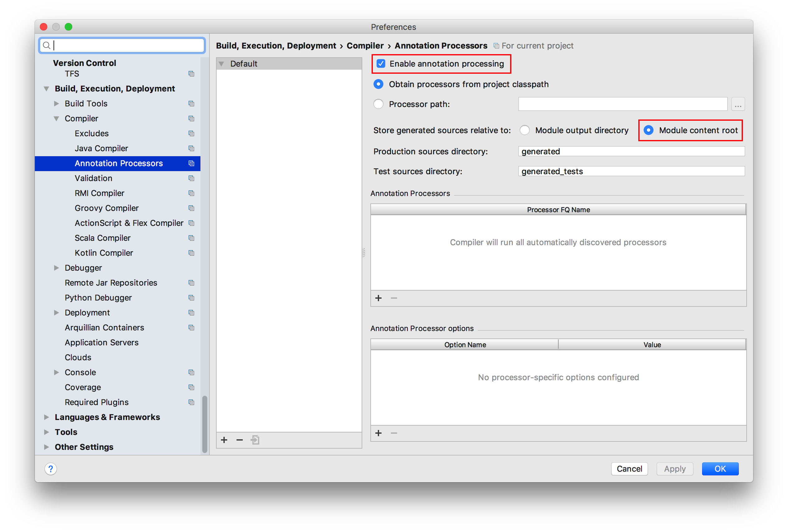
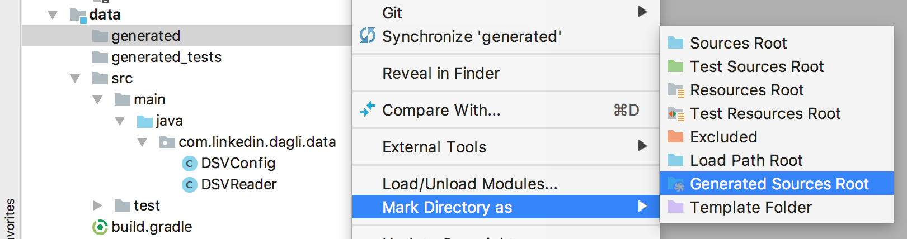

# @Structs
The idea behind @Structs is to provide easy-to-use and difficult-to-misuse "structures", Java classes that store named (and typed) fields.   

Dagli's `@Struct` annotation can be used to decorate @Struct *definitions*, simple Java classes that Dagli will then use to generate the actual @Struct class.

    @Struct("MyStruct")
    abstract class MyStructBase implements Serializable {
      private static final long serialVersionUID = 1;
      String _name;
      int _age;
      String _email;
    
      @Optional
      String _favoriteColor = "red";
    }
A defining class annotated with `@Struct` will generate a new, **immutable** class, in this case `MyStruct`, using the fields of the definition class.  Because the above `@Struct` definition implements `Serializable` and specifies a version (`serialVersionUID`), the generated @Struct will be serializable.
 
As a matter of style, we recommend making the @Struct definition class `abstract` where appropriate and prepending field names with underscores, but neither of these are required.
 
Structs are typically created via their builder:

    MyStruct struct = MyStruct.Builder
        .setName("Sarah")
        .setAge(100)
        .setEmail("sarah@domain.com")
        .build(); // skip optional favoriteColor
 
 And their fields are typically accessed via getter methods:
 
    int age = struct.getAge()
    String email = struct.getEmail();

In this document, the @Struct refers to the *generated* class (e.g. `MyStruct`), whereas the "defining class" is the manually-created class decorated with the `@Struct` annotation (e.g. `MyStructBase`) from which the @Struct is generated. 

## Benefits of @Structs  
Given a @Struct definition class, Dagli's annotation processor will create a @Struct class with numerous useful (nested) classes and methods, including:

- `equals()` and `hashCode()`
- Getters, such as `getName()`, `getEmail()`, etc.
- In-place builders such as `withName(...)`, `withEmail(...)`
- Builders that statically enforce *completion* of the object, e.g. `MyStruct.Builder.setName("John").setAge(50).setEmail("john@smith.com").build()`.
- Transformers that extract fields from the struct, e.g. `MyStruct.Name` is a transformer that takes a MyStruct instance as input and returns the value of its `_name` field.
- A transformer that assembles an instance of the struct from its inputs (e.g. `MyStruct.Assembled`).
- A `Placeholder` class with handy convenience methods (e.g. `MyStruct.Placeholder`).
- An `ObjectReader` implementation that composes other `ObjectReader`s corresponding to the struct's fields and reads instances of the struct (e.g. `MyStruct.Reader`).
- A `RowSchema` that helps read instances of the struct from tabular data sources (such as CSV files), e.g. `MyStrcut.Schema`

@Struct is especially useful for encapsulating the inputs and outputs to a DAG; rather than using ordinal inputs and outputs (which can result in logic bugs if different inputs/outputs with the same type are accidentally swapped), the struct bundles them as named fields, making code more readable and making it much harder to make mistakes.

For example, assume we're building a model that predicts a person's location; we might express this model as a `DAG4x1<String, Integer, String, String, Location, Location>` that accepts the person's name, age, email address and favorite color, `Location` label and, after the model is trained, will infer a `Location`, or we could much more clearly express this as a `DAG2x1<MyStruct, Location, Location>` (the `Location` label input would only be used when training [preparing] the model, and would be null when doing inference the prepared `DAG2x1.Prepared<...>`). 

## Setting up Gradle to Generate @Structs
Dagli generates @Structs using an annotation processor.  Annotation processors run whenever your project is compiled.  In Gradle 5+, annotation processors must be explicitly imported; consequently, in each module you plan to define @Structs, add these dependencies to your build.gradle file:

    // enable Dagli's annotation processor so we can use @Structs:
    annotationProcessor 'com.linkedin.dagli:annotation-processor:[version]'
    compileOnly 'com.linkedin.dagli:annotation-processor:[version]'

(where `[version]` is the version of Dagli you're currently using, such as `14.0.0-beta2`.)  

Note on `compileOnly`: <small>the `compileOnly` statement adds the annotation processor to the classpath during 
compilation (only); in our testing, we found this unnecessary for Gradle builds, but omitting it may prevent
IntelliJ from discovering and running the processor.  Since `compileOnly` will not add runtime dependencies, we suggest 
including this line for the benefit of IDE users.</small>
    
## Setting up IntelliJ to use @Structs
IntelliJ does not process annotations (like @Struct) by default, so if you want to run your @Struct-bearing code within the IDE you'll need to configure it:

1. Enable Annotation Processing: In IntelliJ's Preferences dialog, search for "Annotation" to find the Annotation Processors section.  Check "Enable annotation processing" and "Module content root".  
2. Mark Generated Source Directories: use IntelliJ's **Build > Rebuild Project** command to rebuild your project, creating the **generated** and **generated_tests** directories in each module in your project.  
3. Mark the **generated** folder by right-clicking on it and selecting **Mark Directory as > Generated Sources Root**.  
4. If your tests define @Structs, you may also want to mark the **generated_tests** directory; the easiest way to do this is to use **Mark Directory as > Test Sources Root**.

## Updating .gitignore
You shouldn't commit the generated and generated_tests directories in your project, since they'll be (re)generated whenever your code compiles.  Add them to your .gitignore file.

## Advanced @Structology
#### Extending @Structs
@Structs can extend other structs:

    @Struct("MyDerivedStruct")
    abstract class MyDerivedStructBase extends MyStruct {
        int _additionalField;
    }
    
A @Struct extending another @Struct will (of course) inherit all its fields.

#### Optional Fields
As with our `MyStruct` example's `_favoriteColor` field, a @Struct may have optional fields marked as `@Optional`.  If not set using the builder (e.g. `MyStruct.Builder`) these fields will assume the default value provided on the base class. 

#### Type Parameters
@Structs can be defined with type parameters; e.g. the @Struct `MyGenericStruct<L extends CharSequence>` may be defined as:

    @Struct("MyGenericStruct")
    abstract class MyGenericStructBase<T extends CharSequence> {
        List<T> _textList;
    } 

#### Methods on @Structs
@Structs extent their defining base class; to define a method for a @Struct, just add it to the base class.

#### Virtual Fields on @Structs
The `@VirtualField` annotation may be applied to a parameterless method in a @Struct definition class, which will cause Dagli to generate a corresponding inner class on the @Struct (a transformer may be used to obtain the virtual field's value) and otherwise treat it as a read-only field.

#### `@TrivialPublicConstructor`
When added to a @Struct definition class with no *non-optional* fields, Dagli will generate a trivial (parameterless) constructor for the generated @Struct, providing an alternative to using the builder. 

#### `Externalizable` Classes
When a @Struct definition class (or a class that it extends) implements `java.io.Externalizable`, Dagli will automatically create a trivial (parameterless) constructor as required by `Externalizable`; however, it will not autogenerate methods implementing the interface, so either your @Struct definition class or an ancestor class must do so.  Note that `Externalizable` thus (unfortunately) requires permitting creation of instances of your @Struct that have not had their required fields (if any) set.

#### Defining @Structs with Unmodifiable Classes
Sometimes you may want to create a @Struct from a class you cannot directly annotate with `@Struct`, e.g. a class autogenerated from an Avro schema.  Just create a new `@Struct`-annotated @Struct definition class that `extends` the unmodifiable class.  `@OptionalField` may then be used to decorate your new @Struct definition class with the names of any fields that should be optional (since you can't apply `@Optional` to the field directly in the unmodifiable ancestor class). 

#### Creating @Structs in Different Packages
Although not recommended, it is possible to generate the @Struct in a different package than the class defining it.  For example, we could have declared our `MyStructBase` as public and annotated it as `@Struct("foo.bar.MyStruct")` to generate the @Struct class in the package `foo.bar`.

#### Implementing Visitors
To automatically generate a visitor interface for one or more @Structs, add the `@VisitedBy("VisitorName")` annotation to your @Struct definition class.  `@VisitedBy(...)` may also be used with non-@Struct classes, too. 

#### Why `MyStruct.Builder` and not `MyStruct.builder()`?
Because static methods on derived classes are required to have return types that match (or extend) the return type of a
hidden static method of the superclass, defining a static `builder()` method would make it impossible for @Structs to
extend other @Structs without compromsing the builder API.  Nested classes on @Struct, such as `MyStruct.Assembled`,
still use a more "traditional" `builder()` method because they don't need to be extended.  

## Example of @Struct's Autogenerated Producer and Transformers

    Placeholder<MyStruct> struct = new MyStruct.Placeholder();
    // equivalent to: MyStruct.Age age = new MyStruct.Age().withInput(struct);
    Producer<Integer> age = struct.asAge();
    
    // We can also do the inverse and assemble an instance of MyStruct from its fields:
    Producer<String> name = ...;
    Producer<Integer> age = ...;
    Producer<String> email = ...;
    Producer<String> favoriteColor = ...;

    MyStruct.Assembled struct = MyStruct.Assembled.builder()
        .setName(name)
        .setAge(age)
        .setEmail(email)
        .setFavoriteColor(favoriteColor) // not required
        .build();

## Example of Reading @Structs from a CSV 

    DSVReader<T> reader = new DSVReader<T>()
        .withFormat(CSVFormat.DEFAULT.withEscape('\\').withFirstRecordAsHeader())
        .withFile(someCSVPath, StandardCharsets.UTF_8)
        .withSchema(MyStruct.Schema.builder()
            .setNameColumnName("Name")
            .setAgeColumnName("Age")
            .setEmailColumnName("E-mail")
            .setFavoriteColor("FavColor")
            .build());
            
    for (MyStruct struct : reader) {
        // do something with struct
    }
