# Version 15.0.0-beta3 Changelog
- Input configurators such as `DenseFeatureVectorInput` now provide a standardized, convenient way to specify inputs.
    - Correspondingly, the API for many transformers and neural network layers have been greatly simplified and 
      standardized; e.g. `new NNDenseLayer().withInputFromDensifiedVectors(...)` is now 
      `new NNDenseLayer().withInput().fromVectors(...)`.
    - The `AbstractInput` and vector configurators can be found 
      [here](../common/src/main/java/com/linkedin/dagli/input/).
- `MermaidVisualization` in the `visualization-mermaid` module now provides visualizations of Dagli graphs as Mermaid 
   markup.  For example, here's a visualization of the neural network bag-of-ngrams example with the values for a single
   training example displayed along the edges:

   
- New visualization API: `AbstractVisualization` in the `visualization` module can be extended to create new 
  visualizers in addition to the existing Mermaid and ASCII (`visualization-ascii`) alternatives.
- Dagli's Kryo 4.* dependencies have been updated to Kryo 5.
- All Dagli nodes (and neural network layers) now implement the `Named` interface and can be given arbitrary names via 
  their `withName(...)` methods (this is primarily useful for distinguishing nodes when visualizing the graph).
- `LinkedStack` (a stack implemented as a singly-linked list) is now immutable and replaces `LinkedNode`.
- Three transformers have been renamed for consistency with the naming of other transformers:
    - `VectorAsDoubleArray` is renamed to `DoubleArrayFromVector`
    - `SparseVectorizedDistribution` is renamed to `SparseVectorFromDistribution`
    - `DenseVectorizedDistribution` is renamed to `DenseVectorFromDistribution`
- `LiblinearClassification` now uses `DenseVector` features, allowing the work of "densifying" the feature vector to be
  done discretely in the DAG rather than in the model transformer itself (all other models that require dense features 
  already do this). 
- Added `xgboost-core` module which includes the XGBoost transformers without the XGBoost4J dependency, allowing the
  client to use their own XGBoost4J dependency (for Windows or multi-threaded OSX support).  The `xgboost` module 
  continues to include the official XGBoost4J release (currently supporting Linux and single-threaded OSX).